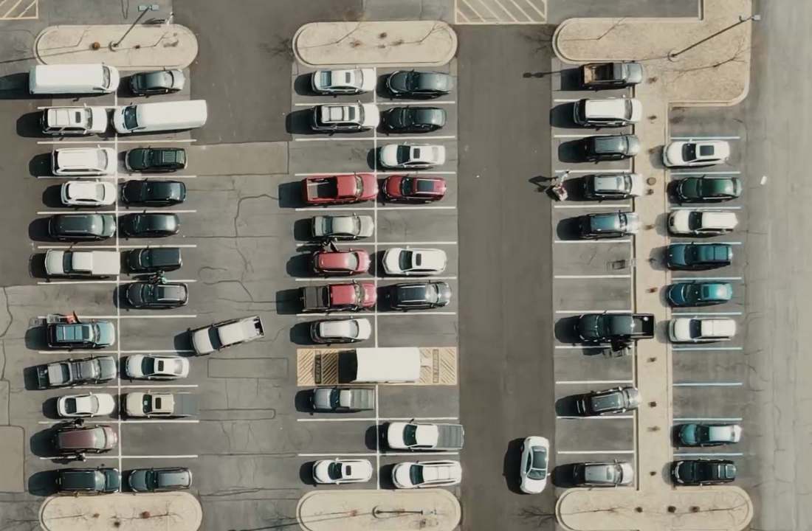
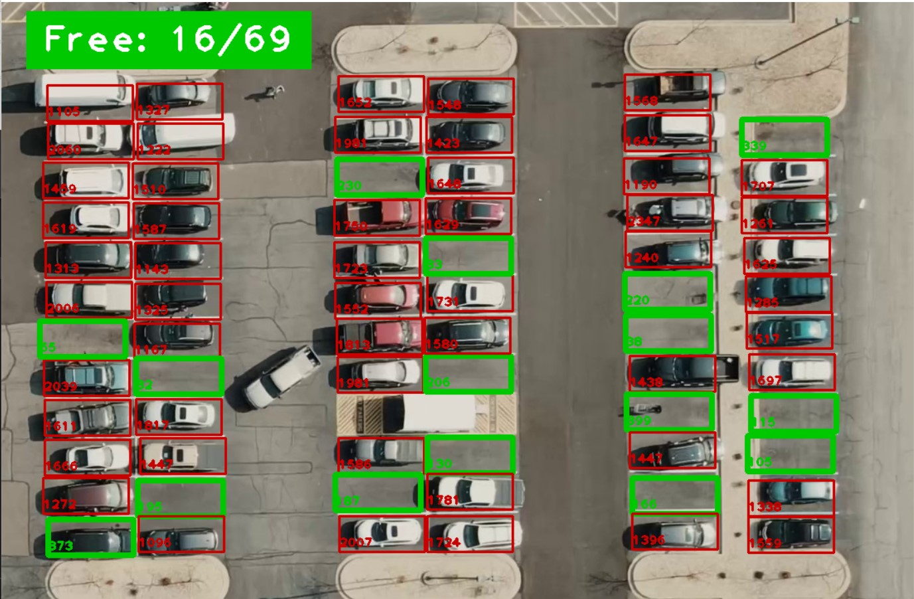
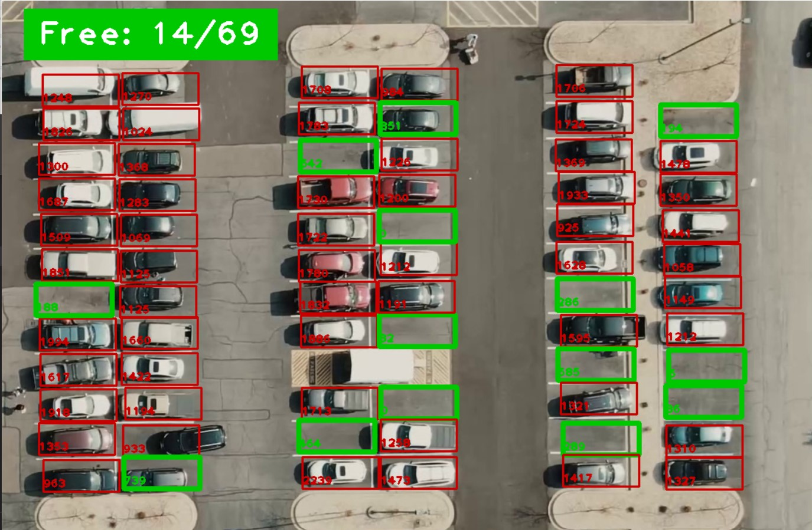

# Vacancy Detector
This program uses python opencv library to track parking spaces and counts the vacancies available in real time from a stream of images.

#### Frame from raw video

#### Frames from programs output

